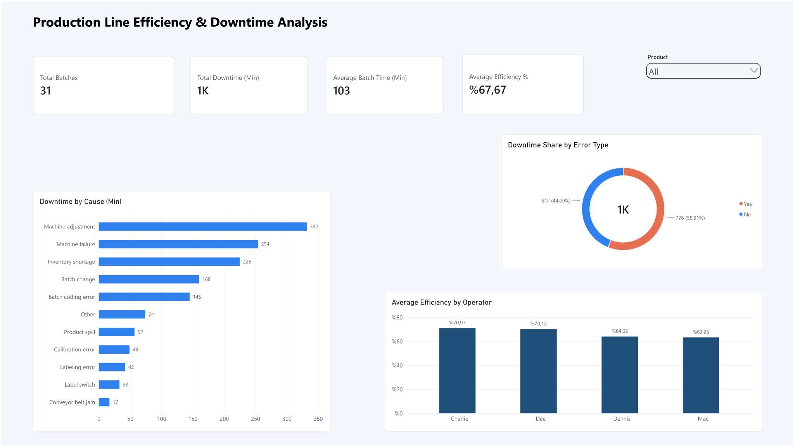

# Production Line Efficiency Analysis

A Power BI project analyzing the efficiency of a soft-drink bottling line: how long each batch takes compared to its minimum target time, what causes downtime, and how performance differs across operators.

## Business Questions

- How efficient is the production line overall, and how does efficiency vary by batch, product and operator?
- What are the main causes of downtime, and how much time does each one cost?
- How much downtime is caused by operator error and how much by other factors?
- Where should improvement efforts be focused first?

## Dataset

The dataset covers 31 production batches of six 600 ml soft-drink products, with batch-level downtime recorded across 12 downtime factors.

| File | Description |
|---|---|
| `line-productivity.csv` | Fact table: date, product, batch, operator, start and end time of each batch |
| `line-downtime.csv` | Downtime minutes per batch for each of the 12 downtime factors |
| `downtime-factors.csv` | Lookup table: factor description and whether it is an operator error |
| `products.csv` | Lookup table: product flavor, size and minimum batch time |
| `metadata.csv` | Field-level descriptions of all tables |

## Approach

1. **Data preparation (Power Query):** imported the pipe-delimited files, unpivoted the downtime table from wide to long format and set data types.
2. **Data model:** built a star schema with `line-productivity` and downtime as fact tables and `products` and `downtime-factors` as dimensions.
3. **DAX measures:** batch duration, total downtime, operator vs. non-operator downtime, and **efficiency = minimum batch time / actual batch time**.
4. **Dashboard:** KPI cards, downtime by factor (Pareto view), operator comparison and batch-level efficiency.

## Key Insights

- **31 production batches** were analyzed, with an average production efficiency of **67.67%**.
- Total recorded downtime reached **1,388 minutes**.
- **Operator-related issues accounted for 776 minutes (55.91%)** of downtime, and non-operator causes for **612 minutes (44.09%)**.
- The three largest downtime causes, **Machine Adjustment (332 min), Machine Failure (254 min) and Inventory Shortage (225 min)**, generated **811 minutes**, about **58.4% of total downtime**.
- Operator efficiency varied noticeably: **Charlie had the highest average efficiency at 70.97%** and **Mac the lowest at 63.26%**, a **7.71 percentage-point gap**.
- The average batch duration was about **103 minutes**.

## Business Implications

Production losses are not driven by a single factor. More than half of the downtime is linked to operator-related issues, while machine adjustment, machine failure and inventory shortages together account for most of the recorded downtime.

Recommended improvement areas:

- Standardize machine adjustment procedures to reduce setup-related downtime.
- Strengthen preventive maintenance to minimize machine failures.
- Improve inventory planning to prevent material shortages during production.
- Investigate operator-level performance differences and provide targeted training and process standardization.

These actions could increase production efficiency, reduce avoidable downtime and make the production process more consistent.

## Tools

- Power BI Desktop
- Power Query
- DAX

## How to Use

1. Clone or download this repository.
2. Open `Production_Line_Efficiency_Analysis.pbix` in Power BI Desktop.
3. If prompted, point the data source paths to the files in the `data/` folder.
4. Explore the dashboard and use the filters to analyze the data interactively.
